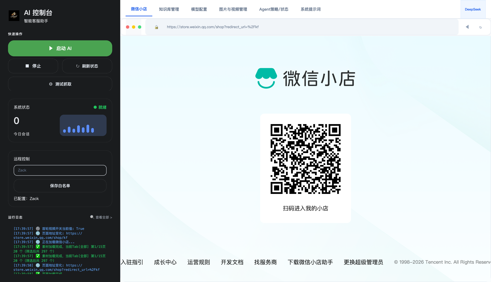
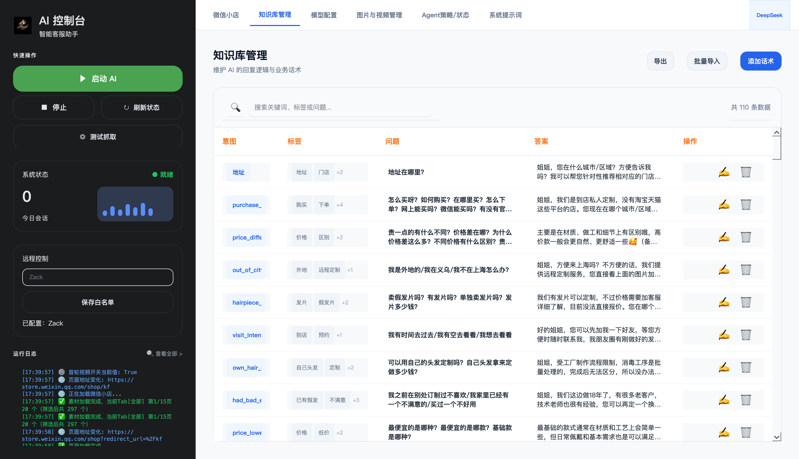
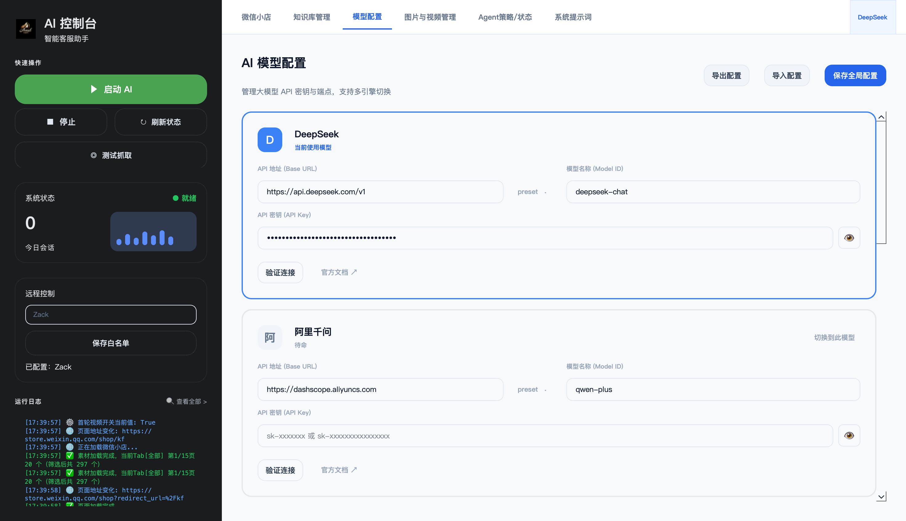
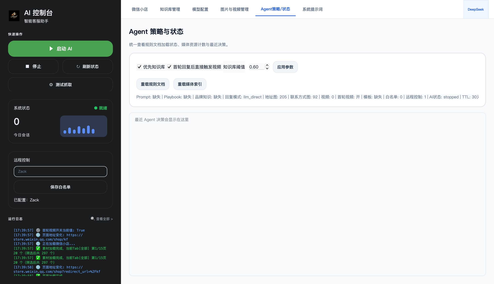

<div align="center">

# 💬 微信小店自动化 AI 客服系统

**LLM-First Agent 架构 · 自动回复 · 智能发图 · 会话记忆 · 多模型热切换**


</div>

---

一套跑在**桌面端**的微信小店 AI 客服系统：通过 PySide6 + QtWebEngine 内嵌浏览器加载微信小店客服后台，由 Agent 自动扫描未读消息、抓取聊天记录、调用大语言模型（或本地知识库）决策回复，并自动发送文本与媒体素材——把人工客服从重复问答中解放出来，已在一线电商门店场景中实际落地运行。

## ✨ 界面预览

| AI 控制台 · 内嵌微信小店后台 | 知识库管理（110+ 条业务问答） |
| :---: | :---: |
|  |  |
| **多模型配置（Key 全程脱敏）** | **Agent 策略 / 状态** |
|  |  |

## 🤖 核心特性

### Agent 自动回复主链路

```
定时扫描未读（4s 轮询） → 自动点击会话 → 抓取聊天记录
        → 意图识别 → 知识库命中 / LLM 兜底 → 护栏校验
        → 自动发送文本 + 智能媒体 → 会话记忆持久化
```

- **LLM-First 决策**：意图识别优先命中本地知识库（RAG），未命中再走 LLM，并经规则护栏约束输出，避免幻觉与违规话术
- **智能媒体发送**：根据对话内容自动发送门店地址图、联系方式图、延迟加载视频；按用户所在城市**地理路由**推荐对应门店（内置全国省市区映射 + 地址拦截器）
- **跨重启会话记忆**：按用户哈希持久化会话状态（TTL 30 天），记住已确认的门店 / 城市 / 已发素材，防止重复打扰
- **营业时间感知**：非营业时间自动切换收尾话术，消息去重防止重复回复

### 🧠 多模型热切换

统一封装的 LLM 服务层，支持 6 家模型一键切换并带连接测试：

| 已适配 | 协议 |
| --- | --- |
| DeepSeek / ChatGPT / Kimi | OpenAI 兼容 |
| Google Gemini | 原生 REST |
| 阿里千问 | DashScope |
| 豆包 | 火山方舟（Ark） |

### 🛠 工程化配套

- **知识库管理 UI**：可视化维护 110+ 条业务问答（意图 / 标签 / 问题 / 答案），支持批量导入导出
- **聊天模拟器**：`scripts/chat_simulator.py` 可脱离微信后台离线验证策略命中，配套多轮对话回归测试脚本
- **pytest 单元测试**：核心决策链路 11 组测试用例
- **PyInstaller 打包**：支持 Windows / macOS 桌面分发
- **远程控制开关**：白名单用户可远程启停 Agent

## 🏗 技术架构

| 层级 | 技术 |
| --- | --- |
| 桌面框架 | Python 3.13 + PySide6（QtWebEngine 内嵌 Chromium） |
| 页面控制 | JavaScript 注入 + DOM 抓取（4s 轮询未读） |
| Agent 决策 | 意图识别 → 知识库命中 → LLM 兜底 → 护栏校验 |
| LLM 服务 | QThread 异步调用，6 家模型统一适配 |
| 数据持久化 | JSON 配置 + 会话记忆文件（按用户哈希分片） |
| 测试 / 打包 | pytest + PyInstaller |

## 🚀 快速开始

```bash
# 1. 安装依赖（需要 Python 3.13）
pip install -r requirements.txt

# 2. 配置模型 API Key（任选一家）
cp config/model_settings.example.json config/model_settings.json
# 编辑 model_settings.json，填入 api_key / base_url / model

# 3. 启动应用
python3 main.py
```

启动后在顶部导航进入「模型配置」填好 Key → 回到「微信小店」页扫码登录客服后台 → 点击「启动 AI」即可接管客服会话。

```bash
# 离线验证 Agent 决策（无需登录微信）
python3 scripts/chat_simulator.py -m "你们店在哪里" --no-llm

# 运行单元测试
pytest tests/ -v
```

> ⚠️ **使用提示**：本项目仅用于自己店铺的合规客服自动化，请遵守微信小店平台规则；API Key 等敏感配置均通过本地配置文件读取，已通过 `.gitignore` 排除，请勿提交到仓库。

## 🗺 Roadmap

- [ ] RAG 向量化检索升级（当前为关键词 + 阈值命中）
- [ ] 客服会话数据看板（转化漏斗 / 高频问题聚类）
- [ ] 多店铺多账号并行托管

---

<div align="center">

**微信小店自动化 AI 客服系统** · Built with PySide6 & LLM Agent

</div>
